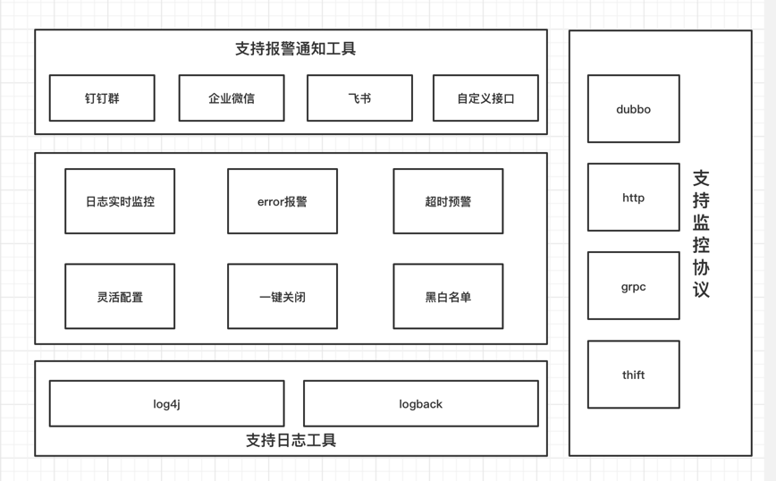
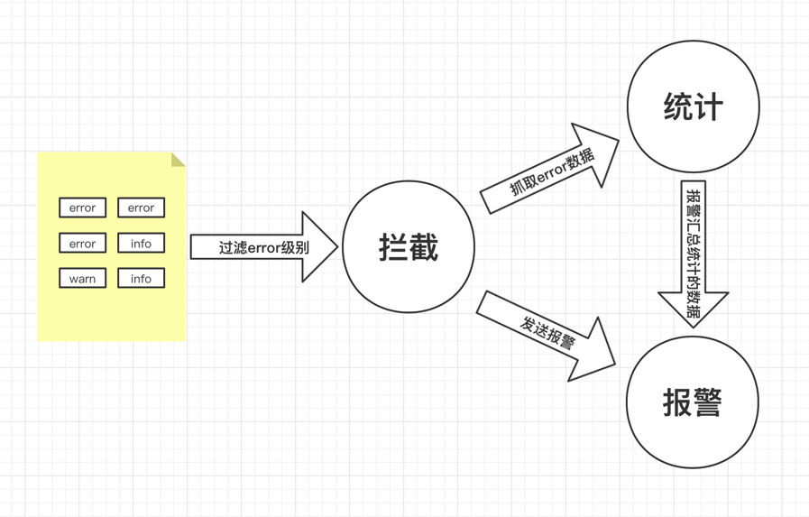

<div align="center">
<h1>📝sky-eye</h1>


</div>

## sky-eye：实时日志报警系统

### sky-eye是什么
目前市面上的日志预警系统绝大部分都是基于队列消费的方式进行异步处理，报警多数有延迟而且不够明确，
针对这个问题，我设计了一套基于日志filter的准实时报警系统，来帮助项目开发维护人员能够更加快速的
感知项目中的各种error日志，进而保障系统稳定性。


### sky-eye 架构设计
sky-eye的主要特性：

流程：


### 快速接入

#### 1、引入包
```xml
<!--log4j版本-->
<dependency>
    <groupId>com.itkevin</groupId>
    <artifactId>log4j-api</artifactId>
    <version>1.0.0</version>
</dependency>

<!--logback版本-->
<dependency>
    <groupId>com.itkevin</groupId>
    <artifactId>logback-api</artifactId>
    <version>1.0.0</version>
</dependency>
```

#### 2、设置设置启动参数
```java
// log4j
    com.itkevin.log4j.api.listener.Log4jApplicationListener
// logback
    com.itkevin.logback.api.listener.LogbackApplicationListener
// 以上两个类交由spring 管理
```
#### 3、apollo配置参数
首先需要创建对应的namespace名称为：skyeye
```properties
# 是否启动报警
skyeye.log.alarm.enabled = true
# 报警钉钉严重错误机器人配置（支持多个机器人）
skyeye.log.alarm.serious.talk.hook = [ { "webHook": "https://oapi.dingtalk.com/robot/send?access_token=xxxxx", "secret": "xxxx" } ]
# 报警钉钉机器人配置（支持多个机器人）
skyeye.log.alarm.talk.hook = [ { "webHook": "https://oapi.dingtalk.com/robot/send?access_token=xxx", "secret": "xxxx" } ]
# 堆栈行数配置
skyeye.log.alarm.stackNum = 10
# 单条报警白名单
skyeye.log.alarm.white.list = 我是白名单
# 聚合报警白名单
skyeye.log.alarm.aggre.white.list = 我是聚合白名单
# 报警间隔时间（单位分钟）
skyeye.log.alarm.notify.time = 1
# 报警次数阀值
skyeye.log.alarm.notify.count = 1
# 接口耗时报警间隔时间（单位分钟）
skyeye.log.alarm.uri.elapsed.time = 1
# 接口耗时超过阀值时间的次数阀值（阀值时间如果不指定则默认1000毫秒）
skyeye.log.alarm.uri.elapsed.count = 10
# 指定URI接口耗时时间阀值（单位毫秒，支持指定多个URI）
skyeye.log.alarm.uri.elapsed = [{"uri":"/user/logTest","elapsed":2000}]
# 指定接口耗时时间阀值（单位毫秒，全局指定，不配置默认1000毫秒）
skyeye.log.alarm.uri.elapsed.global = 1000
# 选择提醒工具
skyeye.log.alarm.tool = wework
# 设置需要监控的logAppender
skyeye.log.appender = file
```
#### 4、通知格式
```
error信息：这是个错误的信息
 服务名称：null
 服务器IP：192.168.199.1
 服务器hostname：localhost
 发生时间：2021-08-22 16:56:06
 请求类型：null
 跟踪traceId：null
 请求URI：null
 异常信息：这是个exception
 异常堆栈：
 这是个堆栈信息  
```
#### 5、自定义通知接入方法
- 1、继承`com.itkevin.common.notice.AbstractNotice`类，实现`com.itkevin.common.notice.NoticeInterface#sendMessage`和`com.itkevin.common.notice.NoticeInterface#filterFlag`两个方法
- 2、在apollo上配置`skyeye.log.alarm.tool`属性，属性值设置为`com.itkevin.common.notice.NoticeInterface#filterFlag`方法的返回值
- 3、在resources目录下创建META-INF.services文件夹创建名为`com.itkevin.common.notice.NoticeInterface`的文件，并将自己的实现类全路径写到这个文件中
- 备注：目前`com.itkevin.common.notice.NoticeInterface#sendMessage`中暂时只支持markdown格式，后期会开放自定义格式

#### 6、自定义配置中心接入方法
- 1、实现`com.itkevin.common.config.ConfigTool`接口
- 2、`com.itkevin.common.config.ConfigTool#getConfig`方法作为配置写入方法，需要把所有的配置信息返回到map中
- 3、`com.itkevin.common.config.ConfigTool#sortFlag`方法是选取配置的方法，系统默认使用Apollo配置中心返回为0，想要使用自己的配置只需要返回一个大于0的数值就可以
- 4、在resources目录下创建META-INF.services文件夹创建名为`com.itkevin.common.config.ConfigTool`的文件，并将自己的实现类全路径写到这个文件中
- 备注：选取配置中心的方法可能不是很优雅，后面版本可能会修改

#### 备注
- 目前接口超时报警仅支持web,后期会同步支持部分的rpc框架
- 目前仅支持apollo配置和钉钉报警，后期会开放配置接口，可自行选择配置，报警接口也会支持企业微信和飞书，并且开放通知接口，可自定接入报警


